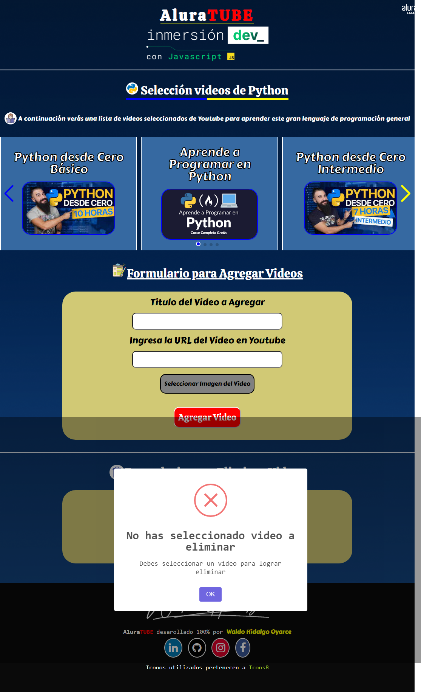
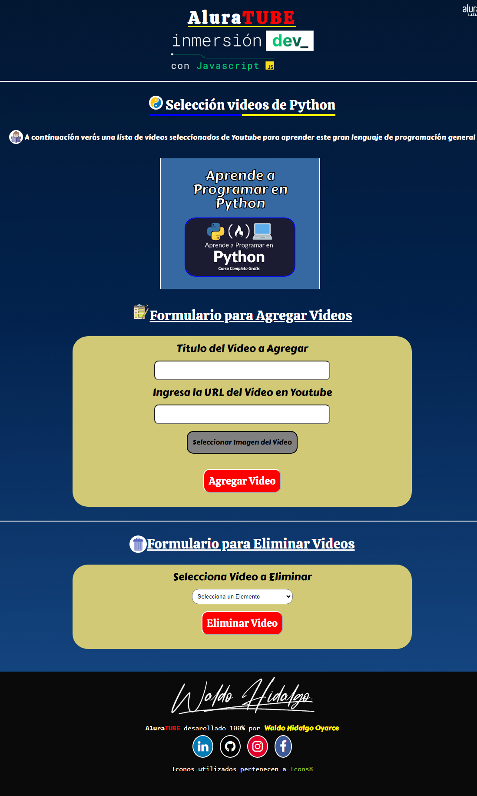
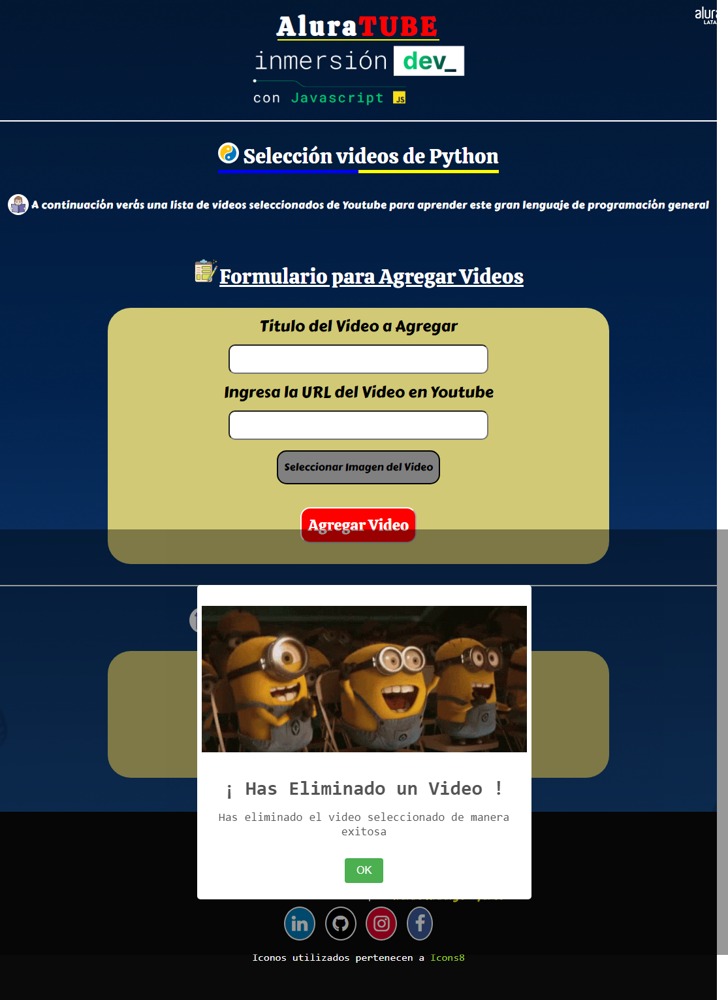
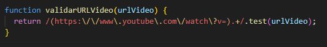
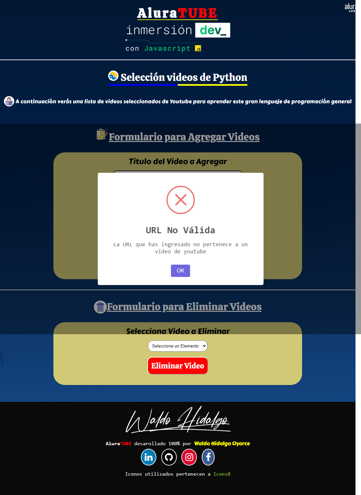
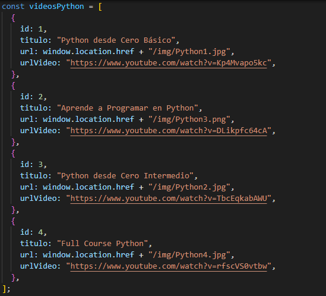
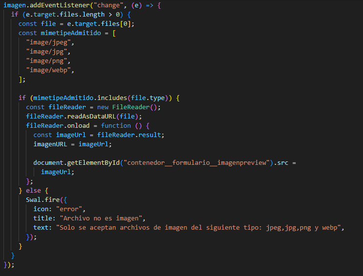
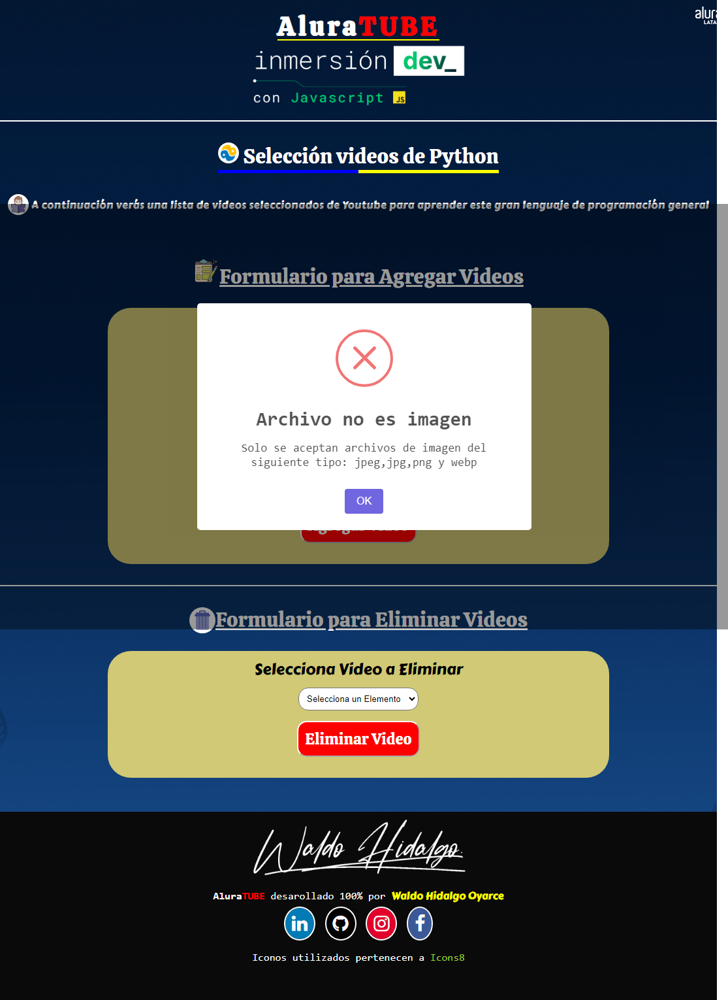
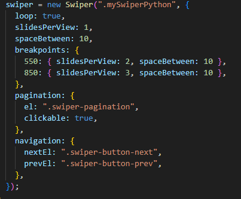

En la cuarta y última clase de la semana de InmersiónDEV con JavaScript se dejaron muchos desafíos los cuales he logrado resolverlos **TODOS** con éxito. A continuación listo cada uno de los desafíos:

1-Crear un botón para eliminar una película en la pantalla

2-Además de agregar la imagen de la película, también añadir el nombre a través de otro input

3-Guardar todas las películas añadidas en una lista/array y recorrer esa lista cada vez que quieras imprimir o eliminar la película (Desafío de [Christian Velasco](https://www.linkedin.com/in/christianpva/))

Esos son los tres desafíos que aparecen en el link de la clase pero en el video los instructores dejan otros más siendo los siguientes:

4- Que solo se acepten imágenes en el input de agregar la URL del video (Desafío de [Jeanmarie Quijada](https://www.linkedin.com/in/jeanmariequijada/))

5-Cuando se haga click sobre la imagen de cada video, visualizar el video en Youtube (Desafío de [Barbara dos Santos](https://www.linkedin.com/in/barbara2-dos-santos/))

Antes de explicar cómo he resuelto los desafíos, contextualizaré. En esta clase 3 se continua con la temática de creación de una pantalla que muestra videos seleccionados por el usuario, en mi caso la temática de los videos seleccionados es aprender a programar con Python. En mi proyecto de la clase 3 he creado un slider con los videos seleccionados y además he creado un formulario que permite al usuario **AGREGAR** nuevos videos al slider. En esta clase 4 he creado en mi proyecto un nuevo formulario que permite **ELIMINAR** videos que ya estan agregados y mostrados en el slider. Mi proyecto comienza con 4 videos por defecto y los 4 videos los muestro en el slider. A continuación muestro la página que he construido:

## Resolución del Primer Desafío

Como se puede observar en la página completa, he creado no solo un botón para eliminar un video sino que he creado un formulario en el cual el usuario puede seleccionar cuál pelicula desea eliminar y a contiuación hacer click en el botón Eliminar Video para eliminar el video del slider. El slider se actualiza, automáticamente, cada vez que se elimina un video así como también se actualiza el listado de videos que se muestran en el tag HTML select que permite seleccionar videos.

Dicho formulario presenta una validación cuando se pretende eliminar un video sin seleccionar un elemento del listado del select y para ello muestro la siguiente alerta:

Para demostrar que la eliminación funciona, a continuación muestro la página completa con solo 1 video:

Cuando la eliminación es exitosa se muestra la siguiente alerta:

## Resolución del Segundo Desafío y del Quinto Desafío

He creado 3 inputs de ingreso de data relacionada al video. El primer input permite el ingreso del título del video, el segundo input permite el ingreso de la URL del video de youtube al cual se redirige al hacer click sobre la imagen y el tercer input permite el ingreso de la imagen. Para validar la URL del video de youtube he creado una función que realiza dicha validación por medio de una expresión regular. Dicha función es la siguiente:

Cuando se ingresa una URL de video de youtube incorrecta se muestra la siguiente alerta:

## Resolución del Tercer Desafío

He creado un array de objetos y cada objeto almacena en sus atributos datos relacionados al video. Dicho array de objetos es el siguiente:

## Resolución del Cuarto Desafío

El cuarto desafío lo he resuelto realizando una validación del **tipo de archivo cargado al input de tipo file** y para ello agrego un escuchador de eventos del tipo de evento change al tag HTML input del tipo file. Cada vez que se carga un archivo dicho evento se dispara y allí realizo la validación del tipo de archivo. A continuación muestro dicho código:

Cuando se ingresa un archivo que no es del tipo jpeg, jpg, png o webp, se muestra la siguiente alerta:

Como auto desafíos me di la tarea de hacer la página 100% responsiva adaptandose a todas las pantallas. El número de slides del slider se modifica en función del tamaño de la pantalla en base a los siguientes breakpoints:

Dicho código establece una slide desde 0px a 549px, 2 slides desde 550px a 849px y 3 slides desde 850px.

Si se recarga mi página web, todos los cambios hechos se revierten al estado inicial por defecto ya que las operaciones solo se realizan en el navegador.
